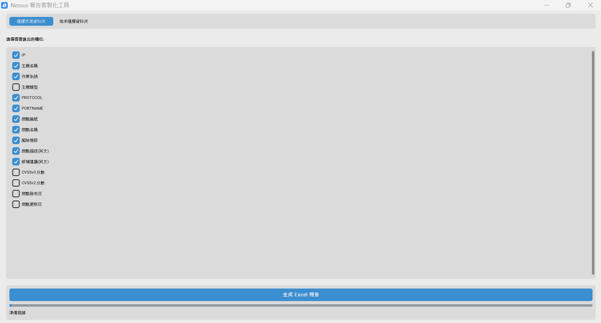
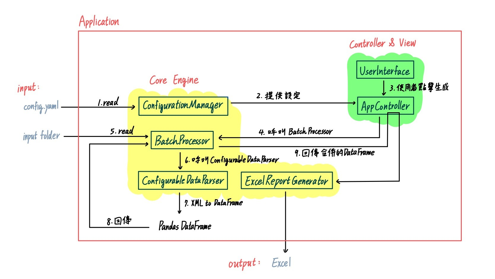

# Nessus 報告客製化軟體




一個強大且易於使用的桌面應用程式，旨在將繁瑣的 Nessus XML 弱點報告，快速轉換為格式精美、內容客製化的 Excel 檔案。專為提升資安分析師與專案管理人員的工作效率而設計。

備註：<NessusClientData_v2>

---

## **目錄**

* [**1. 專案概述**](#1-專案概述)
* [**2. 功能特色**](#2-功能特色)
* [**3. 安裝指南**](#3-安裝指南)
* [**4. 使用範例**](#4-使用範例)
* [**5. 組態選項**](#5-組態選項)
* [**6. 設計架構**](#6-設計架構)

---

## **1. 專案概述**

本專案的核心目標是將 Nessus 弱點掃描報告的處理流程自動化。透過一個直觀的圖形化介面，使用者可以批次處理多份 `.nessus` 報告，並根據一個外部設定檔 (`config.yaml`) 動態選擇所需欄位，最終生成一份可立即用於匯報或分析的 Excel 報告。

專案採用了現代化的軟體架構（MVC/MVP），透過多執行緒處理確保介面流暢，並利用設定檔驅動的設計實現了高度的可擴充性。

## **2. 功能特色**

* **圖形化使用者介面 (GUI)**: 基於 `CustomTkinter` 跨平台的介面。
* **批次處理**: 支援一次性處理整個資料夾的報告，大幅提升效率。
* **動態欄位選擇**: 透過 UI 上的核取方塊，自由組合您需要的報告欄位。
* **高度客製化**: 系統的解析規則完全由外部 `config.yaml` 檔案定義，無需修改程式碼即可擴充。
* **專業級 Excel 輸出**: 自動調整欄寬、凍結首行、內建篩選器，報告開箱即用。
* **非阻塞式處理**: 將耗時的檔案處理任務放到背景執行緒，確保 UI 不會卡頓。
* **穩健的錯誤處理**: 能優雅地處理空資料夾、損毀的 XML 檔案等異常情況。

---

## **3. 安裝指南**

### **先決條件**

* Python 3.8 或更高版本 (本軟體開發時使用 python 3.12.1)
* `pip` 套件管理器

### **安裝步驟**

1.  **複製本倉庫**
    ```bash
    git clone [https://github.com/M4RVjN/NessusReportCustomizer.git](https://github.com/M4RVjN/NessusReportCustomizer.git)
    cd your-repository-name
    ```

2.  **建立虛擬環境 (強烈建議)**
    ```bash
    # 建立虛擬環境
    python -m venv .venv

    #建立虛擬環境(建議使用 3.12.1 版本)
     py -3.12 -m venv .venv

    # 啟動虛擬環境 (Windows)
    .\.venv\Scripts\activate

    # 啟動虛擬環境 (macOS/Linux)
    source .venv/bin/activate
    ```

3.  **安裝依賴套件**
    ```bash
    pip install -r requirements.txt
    ```

---

## **4. 使用範例**

1.  **執行程式**
    在專案根目錄下，執行主程式：
    ```bash
    python main.py
    ```
    此處也可使用 pyinstaller 進行打包( 位於檔案根目錄下 )：
    ```bash
    pyinstaller NessusTool-Marvin.spec
    ```
    完成後直接使用 .exe 執行
3.  **選擇來源資料夾**
    點擊「選擇資料夾」按鈕，並選擇一個存放了您的 `.nessus` 檔案的資料夾。

4.  **勾選所需欄位**
    在中間的滾動區域，勾選所有您希望出現在 Excel 報告中的欄位。

5.  **生成報告**
    點擊「一鍵生成 Excel 報告！」按鈕，選擇報告的儲存位置和檔名。

6.  **完成**
    下方的進度條將顯示處理進度。完成後，程式會彈出成功提示視窗。

---

## **5. 組態選項**

本系統的核心是 `config.yaml`，它定義了所有可選欄位的解析規則。

### `config.yaml` 結構詳解

每個欄位都是一個包含以下鍵的物件：

| 鍵 (Key)      | 型別      | 是否必要 | 說明                                                              |
| :------------ | :-------- | :------- | :---------------------------------------------------------------- |
| `id`          | `string`  | 是       | 欄位的唯一內部識別碼，必須是英文且不重複。                         |
| `displayName` | `string`  | 是       | 顯示在 UI 和 Excel 標頭上的名稱。                                 |
| `path`        | `string`  | 是       | 用於提取資料的 XPath 路徑。`@` 表示屬性，`/text()` 表示文字。     |
| `source_tag`  | `string`  | 是       | XPath 的查詢起點，通常是 `ReportItem` 或 `ReportHost`。           |
| `default`     | `boolean` | 否       | 若為 `true`，此欄位在 UI 啟動時會預設被勾選。                     |
| `mapping`     | `object`  | 否       | 一個鍵值對應表，用於將原始值（如數字 `4`）轉換為文字（如 `Critical`）。 |

---

## **6. 設計架構**

